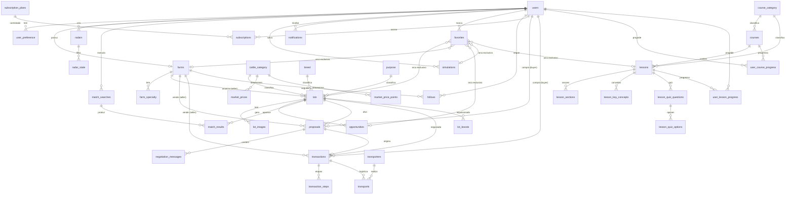

# BTA — Banco de Dados PostgreSQL

Banco relacional do **BTA — Bovinos Trade Agro** (marketplace de gado bovino).
Modela todo o domínio hoje mockado no frontend (`src/data/mock.ts`) para que a
camada de dados fictícios possa ser substituída por este banco **sem remodelar o
frontend** — os nomes de tabelas/colunas mapeiam de forma limpa para as
interfaces TypeScript existentes (`Lot`, `Farm`, `Opportunity`, `RadarAlert`,
`ChatMessage`, `SavedSimulation`, etc.). A camada de acesso converte
`snake_case` (banco) → `camelCase` (frontend).

> Este banco é **novo/adicional**. O app é frontend puro (React 19 + Vite + TS);
> não há backend nem migração automática de outra base — o Postgres nasce aqui.

---

## Estrutura da pasta `db/`

```
db/
├── README.md                     ← este arquivo (decisões + diagrama ER)
├── schema/
│   ├── schema.sql                ← DDL consolidado, canônico (40 tabelas)
│   └── dba_hardening.sql         ← índices extras, RLS, roles/grants, autovacuum (roda DEPOIS do schema)
├── migrations/
│   ├── README.md                 ← convenção e ordem de aplicação
│   ├── 000_schema_migrations.sql ← tabela de controle opcional (caminho manual)
│   └── 001..014_*.{up,down}.sql  ← 14 pares versionados e reversíveis
├── seed/
│   ├── seed.sql                  ← dados fictícios coerentes (reaproveitam o mock), transação única
│   └── README.md
├── tests/
│   ├── 01_structure.sql          ← generated columns, CHECKs, índices, ON DELETE
│   ├── 02_constraints_enforced.sql ← inserts inválidos que DEVEM falhar (com ROLLBACK)
│   ├── 03_referential_integrity.sql ← varredura de FKs órfãs + contrato do mock
│   ├── 04_business_invariants.sql  ← fórmulas, exclusive arc, ressync de sequences, contagens
│   └── README.md
└── validate.sh                   ← runner opcional: cria banco efêmero, sobe tudo, roda testes, testa down, derruba
```

Requisito: **PostgreSQL 12+** (generated STORED, `num_nonnulls`).

### Ordem de aplicação

```
migrations/001..014 (up)  →  schema/dba_hardening.sql  →  seed/  →  tests/
```

- `schema/schema.sql` é a **fonte canônica** do DDL. As migrations `001..014`
  são o mesmo DDL particionado por domínio para versionamento; aplicá-las em
  ordem produz exatamente o `schema.sql`.
- `dba_hardening.sql` é **aditivo** (só adiciona índices/RLS/roles); roda depois.
- Rollback: migrations `down` na ordem inversa `014 → 001`.

---

## Decisões de arquitetura

| Tema | Decisão | Justificativa |
|------|---------|---------------|
| **Chave primária** | `bigint GENERATED ALWAYS AS IDENTITY` em todas as tabelas | O frontend usa `id: number` nas interfaces TS; UUID quebraria esse contrato. Onde há necessidade de id público opaco (deep-links), há coluna extra `public_id uuid`. |
| **Dinheiro** | `numeric(14,2)` para totais BRL; `numeric(8,2)` para preços unitários (R$/@, R$/cab, R$/km) | Precisão exata (nunca float). Mapeia direto para `number` no front sem conversão de centavos. |
| **Auditoria** | `created_at`/`updated_at timestamptz` + trigger `set_updated_at()` | Padrão em toda tabela mutável. |
| **Soft delete** | `deleted_at timestamptz` nas entidades de conteúdo do usuário (users, farms, lots, proposals, transactions, radars, simulations, subscriptions) | Preserva histórico do marketplace. Efêmeros (favorites, notifications, messages, otp) usam hard delete. Índices parciais `WHERE deleted_at IS NULL` cobrem as queries "vivas". |
| **Normalização** | 3FN, com denormalizações explícitas | Ver abaixo. |
| **Multi-tenancy** | **Single-tenant** (um marketplace BTA único) | BTA Empresa (§34) é multiusuário dentro do marketplace, não white-label. Sem `tenant_id`. |
| **Enums vs. dimensões** | 15 `ENUM` para conjuntos fixos; tabelas de referência (`cattle_category`, `breed`, `purpose`, `course_category`) para listas extensíveis por admin | Admin adiciona raça/categoria sem migration. |
| **Multiusuário / segurança** | RLS por `app.current_user_id` (GUC de sessão) + 3 roles (`bta_app`, `bta_readonly`, `bta_admin`) | Isola dados privados (radares, propostas, chats) entre usuários; app sem DDL/TRUNCATE. Em `dba_hardening.sql`. |
| **Extensões** | `citext` (e-mails), `pgcrypto` (`gen_random_uuid()`), `pg_trgm` (busca textual) | PostGIS fica para quando houver geo real (ver notas `[GEO]`). |

### Denormalizações permitidas (todas comentadas no DDL)

- **`lots.price_total`** — coluna `GENERATED ALWAYS ... STORED`. Fórmula depende
  da unidade: `'/@'` → `price*(weight/15)*quantity`; `'/cab'` → `price*quantity`.
  É o valor **canônico** (o `priceTotal` hand-authored do mock para lotes `'/@'`
  está incorreto e é ignorado).
- **`transactions.fee_amount`** — `GENERATED` = `total_value * fee_percent/100`
  (comissão/take rate da plataforma, §32, default 1% configurável em
  `platform_settings`).
- **Contadores** — `farms.deals`, `farms.active_lots`, `radars.matches`,
  `lots.views/favorites_count/proposals_count`: derivados, mantidos pela app.
- **`transactions.weight_snapshot`** — congela o peso do lote no fechamento
  para auditar `total_value` de vendas `'/@'` (recomendação do DBA, aceita).

---

## Grupos de tabelas (40 no total)

| Grupo | Tabelas | Representa |
|-------|---------|------------|
| **Referência (4)** | `cattle_category`, `breed`, `purpose`, `course_category` | Dimensões extensíveis por admin |
| **Identidade (2)** | `users`, `user_preference` | Usuário, tags de perfil (auth em provedor externo) |
| **Fazendas e Lotes (4)** | `farms`, `farm_specialty`, `lots`, `lot_images` | Vendedores e anúncios de gado |
| **Mercado (2)** | `market_prices`, `market_price_points` | Preço atual + série histórica diária |
| **Descoberta (5)** | `opportunities`, `radars`, `radar_state`, `match_searches`, `match_results` | Feed, radar, BTA Match |
| **Negociação (6)** | `proposals`, `negotiation_messages`, `transactions`, `transaction_steps`, `transporters`, `transports` | Proposta → chat → negócio fechado → logística (BTA Log) |
| **Academy (8)** | `courses`, `user_course_progress`, `lessons`, `lesson_sections`, `lesson_key_concepts`, `lesson_quiz_questions`, `lesson_quiz_options`, `user_lesson_progress` | Cursos, aulas, quiz e progresso |
| **Simulador (1)** | `simulations` | Simulações salvas (inputs + outputs por cenário) |
| **Engajamento (3)** | `notifications`, `favorites`, `follows` | Notificações, favoritos polimórficos, seguir fazenda |
| **Monetização (5)** | `subscription_plans`, `subscriptions`, `lot_boosts`, `services`, `platform_settings` | BTA PRO/Empresa, impulsionar lote, serviços, config (take rate) |

**Favoritos polimórficos** (`favorites`) usam o padrão *exclusive arc*: uma
coluna FK nullable por alvo (lote/fazenda/oportunidade/simulação/aula) + `CHECK
num_nonnulls(...) = 1`. Preserva integridade referencial real (que um
`type + id` polimórfico puro não garante).

---

## Diagrama ER (mermaid)



---

## Segurança (RLS + roles) — resumo operacional

`dba_hardening.sql` liga **Row-Level Security** nas tabelas de dado privado
(radares, simulações, notificações, favoritos, propostas, transações, chats,
progresso, etc.). O backend precisa, a cada transação autenticada, executar:

```sql
SET LOCAL app.current_user_id = '<id do usuário logado>';
```

Sem esse GUC, as tabelas com RLS retornam 0 linhas — **exceto** a leitura
pública de `lots` publicados e `farms` vivas, e os catálogos (mercado, cursos,
serviços, dimensões). Roles: `bta_app` (DML, sem DDL/TRUNCATE, sujeito a RLS),
`bta_readonly` (só SELECT, para BI), `bta_admin` (jobs/geração de oportunidades).
`platform_settings` (take rate) é **read-only para a app**. PII de terceiros
(telefone/e-mail) sai pela view `v_users_public`, nunca por `SELECT * FROM users`.

Se o backend ainda não seta o GUC, aplique `dba_hardening.sql` **exceto a
seção 6 (RLS)** e ligue-a quando o wiring estiver pronto.

---

## Backup e operação (recomendação do DBA)

- **PITR**: `wal_level=replica` + WAL archiving + base backup semanal — ou, em
  Postgres gerenciado (RDS/Cloud SQL), snapshots automáticos diários + PITR
  (retenção 7–14 dias).
- **Dump lógico** `pg_dump -Fc` diário como segunda linha (restore granular).
- **Vigiar**: bloat / `n_dead_tup` e uso de índices (`pg_stat_user_indexes`) nas
  tabelas quentes (`notifications`, `negotiation_messages`, `lots`, `proposals`,
  `market_price_points`).

---

## Decisões de negócio que PRECISAM do dono do produto

Ver a seção correspondente no relatório de entrega. Em resumo, com recomendação:
representação de dinheiro (→ `numeric`), soft vs. hard delete (→ soft nas
entidades de conteúdo), single-tenant vs. white-label (→ single-tenant),
auth em provedor externo (→ **DECIDIDO: Firebase/Auth0**; sem tabela de OTP no
banco — vínculo em `users.external_auth_id`),
e a fórmula canônica de `price_total` (→ a fórmula por peso, não os totais do
mock). Detalhes e trade-offs no relatório.
